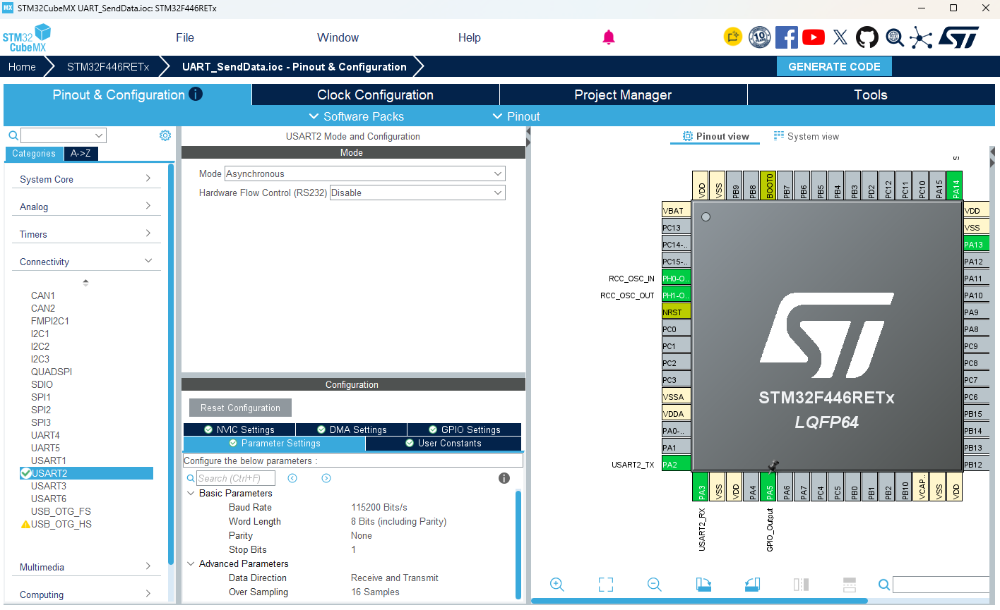
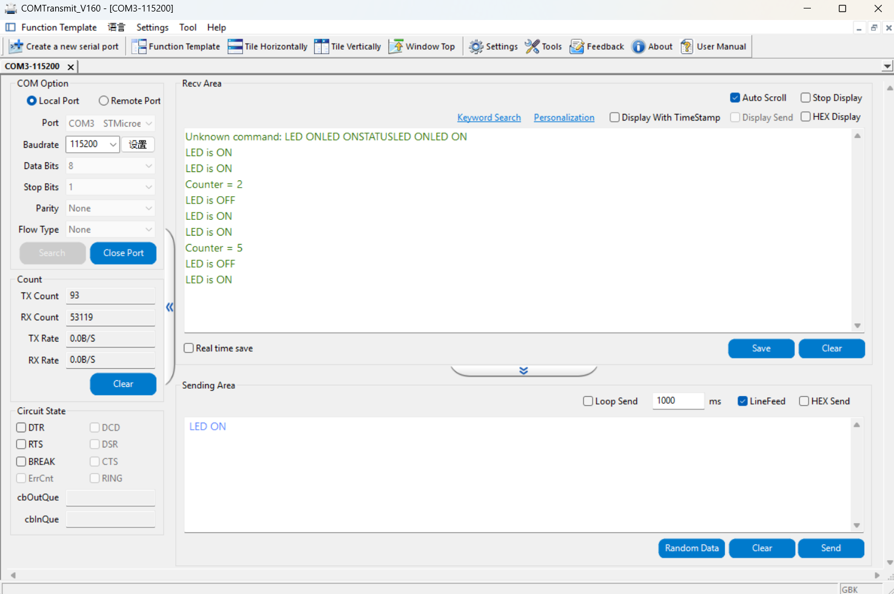
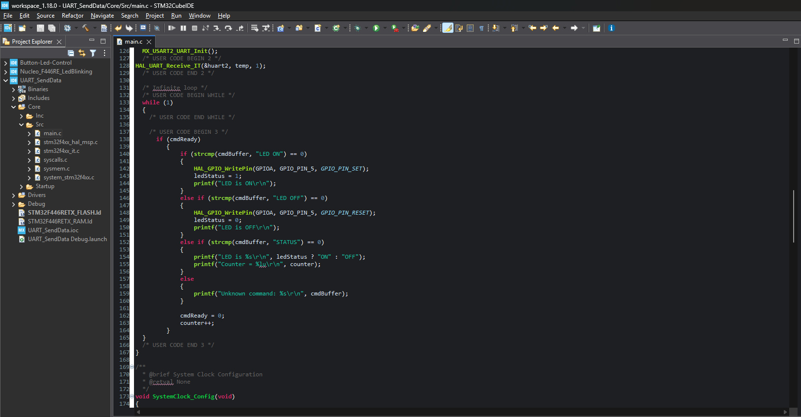

# STM32 UART Command Interface

A simple interrupt-driven UART communication project for the STM32F446RE (Nucleo) board. The board receives text commands from a PC over UART and responds accordingly, turning basic byte-level UART communication into a lightweight command interface.

## Features

- Asynchronous UART communication (USART2) at 115200 baud, 8N1
- Interrupt-driven byte reception (`HAL_UART_Receive_IT`) — no blocking, no polling on the receive side
- Command parsing with a circular buffer, triggered on `\r` / `\n`
- `printf` retargeted to UART via `_write()` for easy debug/response output
- Supported commands:
  - `LED ON` — turns the onboard LED on
  - `LED OFF` — turns the onboard LED off
  - `STATUS` — reports current LED state and command counter

## Hardware

- **Board:** STM32F446RETx (Nucleo-64)
- **UART:** USART2 (PA2 = TX, PA3 = RX), connected via ST-Link Virtual COM Port
- **LED:** PA5 (onboard LD2)

## Tools

- STM32CubeMX — peripheral configuration
- STM32CubeIDE — development and debugging
- COMTransmit — PC-side terminal for sending/receiving UART data

## Screenshots

**STM32CubeMX Configuration**

**COMTransmit Terminal**

**STM32CubeIDE**

## How It Works

1. On startup, the board initializes UART2 and immediately arms a 1-byte interrupt-driven receive (`HAL_UART_Receive_IT`).
2. Each incoming character triggers `HAL_UART_RxCpltCallback`, which appends the byte to a command buffer.
3. When `\r` or `\n` is received, the buffer is null-terminated and a `cmdReady` flag is set.
4. The main loop polls `cmdReady`; once set, it compares the buffer against known commands with `strcmp` and executes the matching action.
5. Responses are sent back over UART using `printf`, retargeted through a custom `_write()` implementation.

## License

This project is provided as-is for learning and practice purposes.
